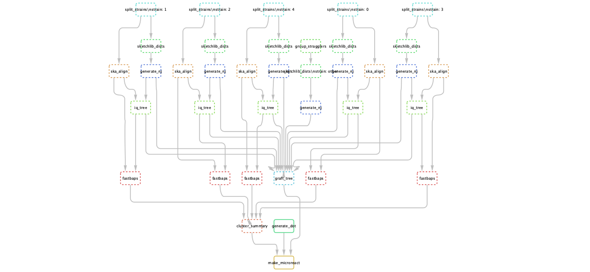

# PopPIPE: Population analysis PIPEline 🛠🧬

Downstream analysis of [PopPUNK](https://www.poppunk.net/) results.

[Further documentation](https://poppunk.readthedocs.io/en/latest/subclustering.html)

## Pipeline description

The pipeline consists of the following steps:
- Split files into their [PopPUNK](https://www.poppunk.net/) strains.
- Use [pp-sketchlib](https://github.com/johnlees/pp-sketchlib) to calculate core and accessory distances within each strain.
- Use core distances and [rapidnj](https://birc.au.dk/software/rapidnj/) to make a neighbour-joining tree.
- (lineage_clust mode) Generate clusters from core distances with lineage clustering in PopPUNK.
- Use [ska](https://github.com/simonrharris/SKA) to generate within-strain alignments.
- Use [IQ-TREE](http://www.iqtree.org/) to generate an ML phylogeny using this alignment, and the NJ tree as a starting point.
- Use [fastbaps](https://github.com/gtonkinhill/fastbaps) to generate subclusters which are partitions of the phylogeny.
- Create an overall visualisation with both core and accessory distances, as in PopPUNK. The final tree consists of refining the NJ tree by grafting the maximum likelihood trees for subclusters to their matching nodes.

### Example pipeline DAG



`ska index` steps (one per sample, and a dependency of all `ska align` steps) have been omitted for simplicity.

## Installation

The supported method is to use conda, which is most easily accessed by first
installing [miniconda](https://conda.io/miniconda.html). PopPIPE simply depends
upon snakemake and pandas:
```
conda install snakemake pandas
```

Other dependencies will be automatically installed by conda the first time
you run the pipeline. You can also install them yourself and omit the `-use-conda`
directive to snakemake:
```
conda create -n poppipe --file=environment.yml
```

If the package cannot be found you will need to add the necessary channels:
```
conda config --add channels r
conda config --add channels defaults
conda config --add channels bioconda
conda config --add channels conda-forge
```

## Usage

1. Modify `config.yml` as appropriate.
2. Run `snakemake --cores <n_cores> --use-conda`.

On a cluster or the cloud, you can use snakemake's built-in `--cluster` argument:
```
snakemake --cluster qsub -j 16 --use-conda
```
See the [snakemake docs](https://snakemake.readthedocs.io/en/stable/executing/cluster-cloud.html)
for more information on your cluster/cloud provider.

### Alternative runs
To create a visualisation on [microreact](https://microreact.org/):
```
snakemake --use-conda make_microreact
```

## Config file

### PopPIPE configuration

* `script_location`: The `scripts/` directory, if not running from the root of this repository
* `poppunk_db`: The PopPUNK HDF5 database file, without the `.h5` suffix.
* `poppunk_clusters`: The PopPUNK cluster CSV file, usually `poppunk_db/poppunk_db_clusters.csv`.
* `poppunk_rfile`: The `--rfile` used with PopPUNK, which lists sample names and files, one per line, tab separated.
* `min_cluster_size`: The minimum size of a cluster to run the analysis on (recommended at least 6).

### SKA configuration

* `fastq_qual`: With read input, the `-q` option, which ignores k-mers with bases below this score.
* `fastq_cov`: With read input, the `-c` option, which sets a minimum k-mer count.

### IQ-TREE configuration

* `enabled`: Set to `false` to turn off ML tree generation, and use the NJ tree throughout.
* `mode`: Set to `full` to run with the specified model, set to `fast` to run using `--fast` (like fasttree).
* `model`: A string for the `-m` parameter describing the model. Adding `+ASC` is recommended.

### fastbaps configuration

* `levels`: Number of levels of recursive subclustering.
* `script`: Location of the `run_fastbaps` script. Find by running `system.file("run_fastbaps", package = "fastbaps")` in R.

### t-SNE configuration

* `perplexity`: Perplexity parameter for t-SNE (between 5 and 50).
* `use_gpu`: Whether to use a GPU for calculating all-vs-all distances.
* `device_id`: Device ID, if using a GPU (default = 0).

### Microreact configuration

* `name`: Title of the Microreact to produce
* `website`: Website link to give in Microreach
* `email`: Contact email to list in Microreact
## Updating a run
Running `snakemake` from the same directory will keep outputs where possible,
so new additions will automatically be included.

**TODO**: How to do this when adding new isolates
