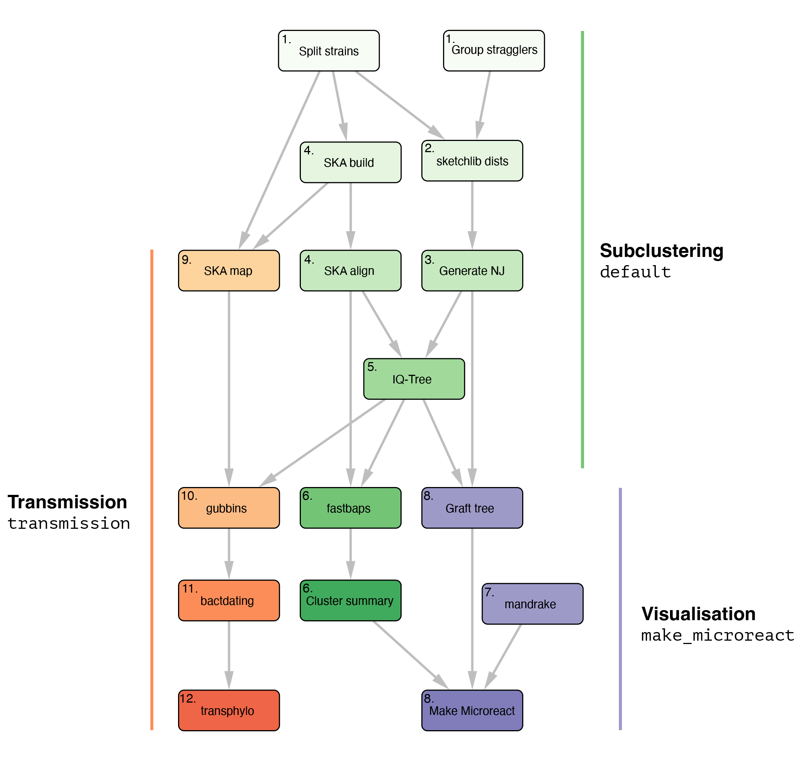

# PopPIPE: Population analysis PIPEline 🛠🧬

[](https://github.com/bacpop/PopPIPE/actions/workflows/docker_push.yml)

Downstream analysis of [PopPUNK](https://www.poppunk.net/) results. Produces subclusters and visualisations of all strains.

## Use cases

### Subcluster analysis (default target)

To run the default pipeline for subcluster analysis run:

`snakemake --cores 4`

The default pipeline consists of the following steps:
- Split files into their [PopPUNK](https://www.poppunk.net/) strains.
- Use [pp-sketchlib](https://github.com/bacpop/pp-sketchlib) to calculate core and accessory distances within each strain.
- Use core distances and [rapidnj](https://birc.au.dk/software/rapidnj/) to make a neighbour-joining tree.
- Use [SKA2](https://github.com/bacpop/ska.rust) to generate within-strain alignments in reference free mode.
- Use [IQ-TREE](http://www.iqtree.org/) to generate an ML phylogeny using this alignment, and the NJ tree as a starting point.
- Use [fastbaps](https://github.com/gtonkinhill/fastbaps) to generate subclusters which are partitions of the phylogeny.



For an example of this analysis, please find data at [10.6084/m9.figshare.28429574](https://dx.doi.org/10.6084/m9.figshare.28429574)

### With `make_microreact` target

`snakemake make_microreact`

In addition to the above:
- Create an overall visualisation with both core and accessory distances, as in PopPUNK. The final tree consists of refining the NJ tree by grafting the maximum likelihood trees for subclusters to their matching nodes.
- Use [microreact](https://www.microreact.org) to display the results.

`snakemake make_microreact`:

### With `transmission` target

`snakemake transmission --cores 4`

In addition to the above, for each strain:
- Use [SKA2](https://github.com/bacpop/ska.rust) map to generate within-strain alignments in reference-based mode.
- Use [gubbins](https://github.com/nickjcroucher/gubbins) to remove recombination.
- Use [bactdating](https://github.com/xavierdidelot/BactDating) to make timed trees.
- Use [transphylo](https://github.com/xavierdidelot/TransPhylo) to infer transmission events on these timed trees.

This requires a `transmission_metadata.csv` file containing sampling times, see the PopPIPE configuration section below for a description of its format.

For an example of this analysis, please find data at [10.6084/m9.figshare.28495571](https://dx.doi.org/10.6084/m9.figshare.28495571).
Input files and config file are in `input/` and the pipeline output after running `snakemake transmission --cores 4` is
in `output/`.

## Installation

The supported method is to use mamba, which is most easily accessed by first
installing [micromamba](https://mamba.readthedocs.io/en/latest/installation/micromamba-installation.html). Install with:
```
mamba create -n poppipe --file=environment.yml
mamba activate poppipe
```
If you are using an ARM Mac, some packages may not be available yet. To use the intel
packages prepend `CONDA_SUBDIR=osx-64` to the `mamba create` command.

### Running inside a container

An alternative, if you are having trouble with the above, is to use the PopPIPE docker
container. If you are comfortable running commands inside docker containers and mounting
your external files, the whole pipeline is in the container available by running:
```
docker pull poppunk/poppipe:latest
```

You can also follow the above process and make a local clone of snakemake, and replace
`--use-conda` with `--use-singularity`, which will automatically pull this container, and run
each step inside it.

Use `--singularity-args` if you need to bind directories.

## Usage

1. Modify `config.yml` as appropriate.
2. Run `snakemake --cores <n_cores>`.

In particular, check the three `poppunk_` arguments, which should be set to the
full path of the `--r-files` argument, strain clusters .csv file and `.h5` database file,
from your PopPUNK run.

On a cluster or the cloud, you can use snakemake's built-in `--cluster` argument:
```
snakemake --cluster qsub -j 16
```
See the [snakemake docs](https://snakemake.readthedocs.io/en/stable/executing/cluster-cloud.html)
for more information on your cluster/cloud provider.

### Creating visualisations
The default target is the first in the Snakefile: `cluster_summary`. This
produces subclusters but no visualisations. To continue the run forward from here
use the `microreact` target:
```
snakemake make_microreact
```

This will create a phylogeny, embedding and format your strains and their subclusters
for [microreact](https://microreact.org/) and save these files to the output. The phylogeny
and clusters will be sent to microreact, and a link to your page will be output to the terminal
and saved in `output/microreact_url.txt`.

**NB** From 2021-10-27 Microreact requires an API key for the final step to work. See the
[microreact docs](https://docs.microreact.org/api/access-tokens) for instructions on how to generate one for your account.

### Running transmission detection
To run the transmission pipeline, make sure you have provided a transmission metadata CSV file
in `config.yml` which lists the sampling dates. The run the transmission target:
```
snakemake transmission
```

## Usage example

TODO

## Config file

### PopPIPE configuration

* `poppipe_location`: The `scripts/` directory, if not running from the root of this repository
* `poppunk_rfile`: The `--rfile` used with PopPUNK, which lists sample names and files, one per line, tab separated.
* `poppunk_clusters`: The PopPUNK cluster CSV file, usually `poppunk_db/poppunk_db_clusters.csv`.
* `poppunk_h5`: The PopPUNK HDF5 database file.
* `transmission_metadata`: (optional) a CSV file with strain names in a column labelled 'Name' and sampling dates labelled 'Date'. The date can be in format YYYY-mm-dd, YYYY/mm/dd or just the year YYYY.
* `min_cluster_size`: The minimum size of a cluster to run the analysis on (recommended at least 6).

### SKA configuration

* `fastq_qual`: With read input, the `-q` option, which ignores k-mers with bases below this score.
* `fastq_cov`: With read input, the `-c` option, which sets a minimum k-mer count.
* `kmer`: The k-mer size, choose longer k-mers for less diverse clusters.
* `single_strand`: Set to true is sequences are single-straded and phased (e.g. RNA viruses).
* `freq_filter`: Minimum frequency of samples a split k-mer must appear in to be in the alignment.

### IQ-TREE configuration

* `enabled`: Set to `false` to turn off ML tree generation, and use the NJ tree throughout.
* `mode`: Set to `full` to run with the specified model, set to `fast` to run using `--fast` (like fasttree).
* `model`: A string for the `-m` parameter describing the model. Adding `+ASC` is not recommended.

### fastbaps configuration

* `levels`: Number of levels of recursive subclustering.
* `script`: Location of the `run_fastbaps` script. Find by running `system.file("run_fastbaps", package = "fastbaps")` in R.

### mandrake configuration

* `knn`: Number of nearest neighbours (at least two).
* `perplexity`: Perplexity parameter for t-SNE (between 5 and 50).
* `maxIter`: Iterations in the optimisation (at least 10000, default 100000).

### Microreact configuration

* `name`: Title of the Microreact to produce
* `website`: Website link to give in Microreach
* `email`: Contact email to list in Microreact
* `api_token`: The API token from your Microreact account

### Gubbins configuration

* `prefix`: Folder name for gubbins results
* `tree_builder`: Program to use to build trees.
* `min_snps`: Min SNPs to identify a recombination block
* `min_window_size`: Minimum window size of blocks
* `max_window_size`: Maximum window size of blocks
* `iterations`: Maximum iterations of tree building and removal

### Transphylo configuration

* `dateT`: Date when transmission stops. If zero, the maximum date is used. If supplied, this needs to be on the same scale as bactdating, which
is number of years since 1970 (i.e. Unix format divided by 365).

Otherwise these options are passed to the `inferTTree()` method in transphylo and we refer users to the [reference documentation](http://xavierdidelot.github.io/TransPhylo/reference/inferTTree.html).

## Updating a run with results from poppunk_assign

You can use the helper script `poppipe_assign.py` to help you re-run after query assignment. For example, if you assigned to a database with:

```
poppunk_assign --db listeria_rlist --query qlist.txt --output listeria_qlist
```

Give the same arguments, and your config file to `python poppipe_assign.py`:

```
python poppipe_assign.py --db listeria_rlist  --query qlist.txt --output listeria_qlist --config config.yml
```

This will generate combined input files, and a new config file. Run snakemake again:

```
snakemake --configfile configv2rfmbr9.yml
```

Here, the first snakemake pipeline ran on four strains consisting of 83 samples:
```
Building DAG of jobs...
Using shell: /bin/bash
Provided cores: 4
Rules claiming more threads will be scaled down.
Job counts:
	count	jobs
	1	cluster_summary
	4	fastbaps
	4	generate_nj
	4	iq_tree
	4	ska_align
	58	ska_index
	4	sketchlib_dists
	4	split_strains
	83
```

The second one, with the new queries, had one more strain, and nineteen new samples to index:
```
Building DAG of jobs...
Using shell: /bin/bash
Provided cores: 1
Rules claiming more threads will be scaled down.
Job counts:
	count	jobs
	1	cluster_summary
	5	fastbaps
	5	generate_nj
	5	iq_tree
	5	ska_align
	19	ska_index
	5	sketchlib_dists
	5	split_strains
	50
```

**NB**: This will re-run all downstream steps for each strain, other than the `ska index` steps. If you have a small number of strains being changed this is likely to be inefficient. If you would like us to support this type of analysis please get in touch.
